# Twogether

안녕하세요, 팀 Twogether입니다.

## 프로젝트 개요

Twogether는 사용자 경험을 최우선으로 고려한 모던 잠옷 쇼핑몰 웹 애플리케이션입니다.  
사용자가 상품을 보다 직관적으로 탐색하고, 간편하게 구매까지 이어질 수 있도록 설계되었습니다.  

단순히 잠옷을 판매하는 쇼핑몰이 아닌 편안한 UI, 빠른 반응 속도, 깔끔한 디자인을 통해  몰입감 있는 쇼핑 경험을 제공하는 것이 저희의 목표입니다.  

## 배포 사이트

 [Twogether 바로가기](https://final-02-twogether.vercel.app)

### 데모 계정 안내
- **로그인**: 로그인 화면에서 바로 사용 가능합니다.
  - ID: `test11@tw.com` / PW: `test11`  

- **회원가입**: 이메일 입력란에 `원하는 값 + @tw.com` 형식으로 입력하면, 별도의 인증 과정 없이 자동으로 가입이 완료됩니다.
  - 예시: `any@tw.com`


## 팀원 소개

<table>
  <tbody>
    <tr>
      <td align="center"><a href="https://github.com/koo-rogie"><br /><sub><b> @koo-rogie </b></a></td>
      <td align="center"><a href="https://github.com/sawajirikim"><br /><sub><b> @ sawajirikim </b></a></td>
      <td align="center"><a href="https://github.com/SiwonYoo"><br /><sub><b> @SiwonYoo </b></a></td>
      <td align="center"><a href="https://github.com/apppiel"><br /><sub><b> @apppiel </b></a></td>
    </tr>
    <tr>
      <td align="center">구성연</td>
      <td align="center">김준성</td>
      <td align="center">유시원</td>
      <td align="center">최승진</td>
    </tr>
  </tbody>
</table>

### 역할 및 구현 페이지

- **구성연**  : [상품 관련 기능](https://github.com/FRONTENDBOOTCAMP-13th/Final-02-Twogether/wiki/Product-Features)
- **김준성**  : [구매 및 결제 기능](https://github.com/FRONTENDBOOTCAMP-13th/Final-02-Twogether/wiki/Purchase-Payment)
- **유시원**  : [회원 관리 기능](https://github.com/FRONTENDBOOTCAMP-13th/Final-02-Twogether/wiki/User-Management)
- **최승진**  : [커뮤니티 기능](https://github.com/FRONTENDBOOTCAMP-13th/Final-02-Twogether/wiki/Community-Features)

## 기술 스택

- 👩‍💻 언어:   
- 📂 프레임워크 & 라이브러리:   
- 🛠 개발 환경: 
- 🤝 협업:     
- 🎨 디자인:        
- 🚀 배포: 


## 설치 및 실행 방법

```bash
git clone https://github.com/SiwonYoo/Twogether.git
cd Twogether
npm install
npm run dev
```

## 주요 화면
<table>
  <tr>
    <td>
      
    </td>
  </tr>
</table>


<table>
  <tr>
    <td>
      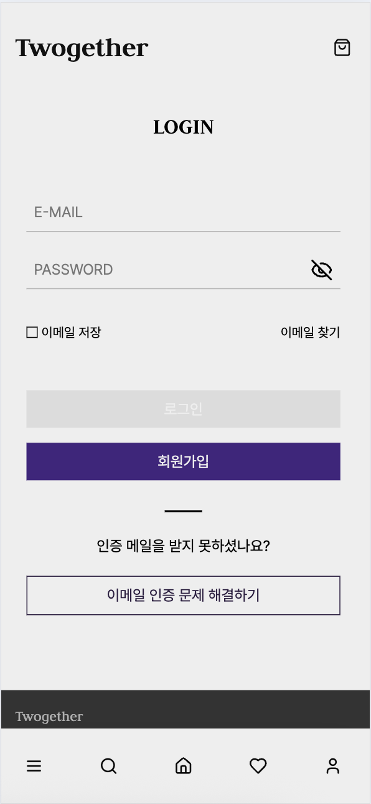
    </td>
    <td>
      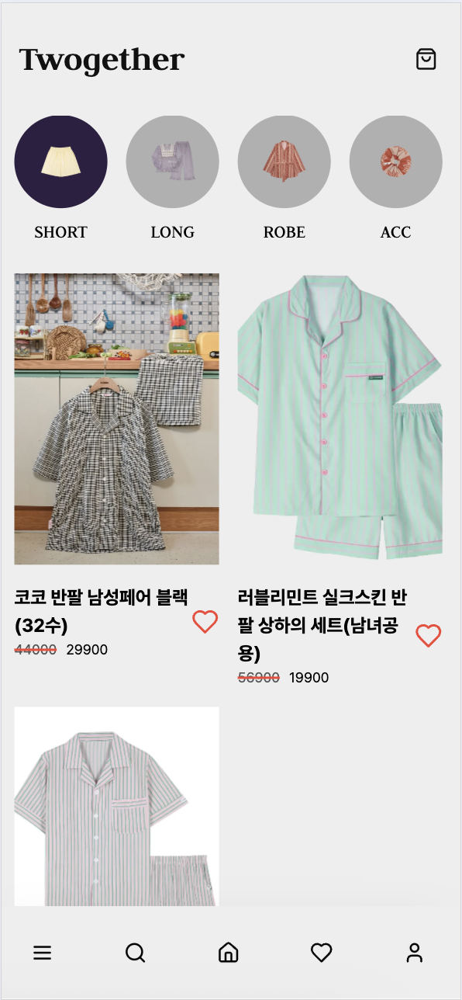
    </td>
    <td>
      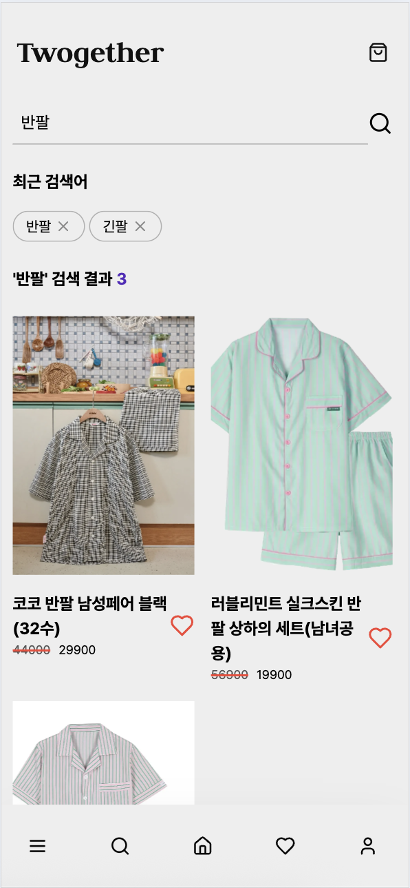
    </td>
  </tr>
  <tr>
    <td>
      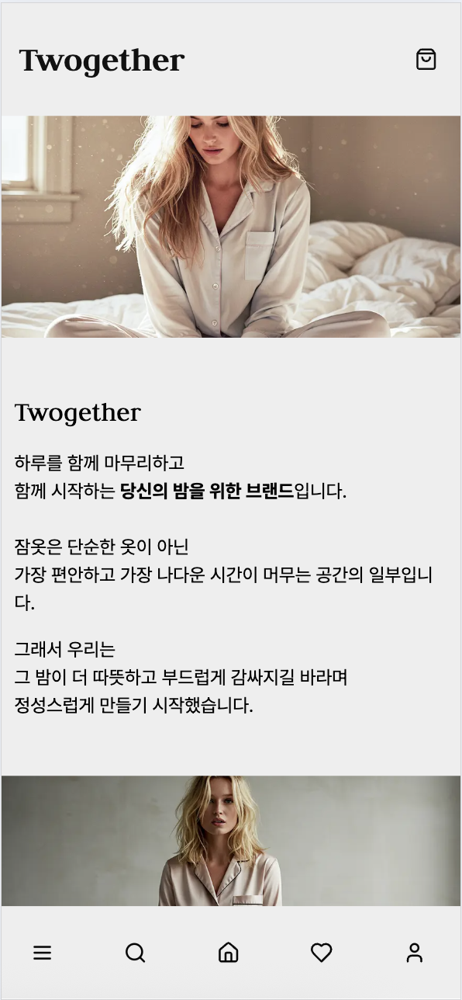
    </td>
    <td>
      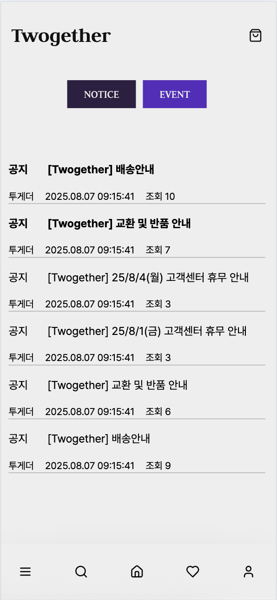
    </td>
    <td>
      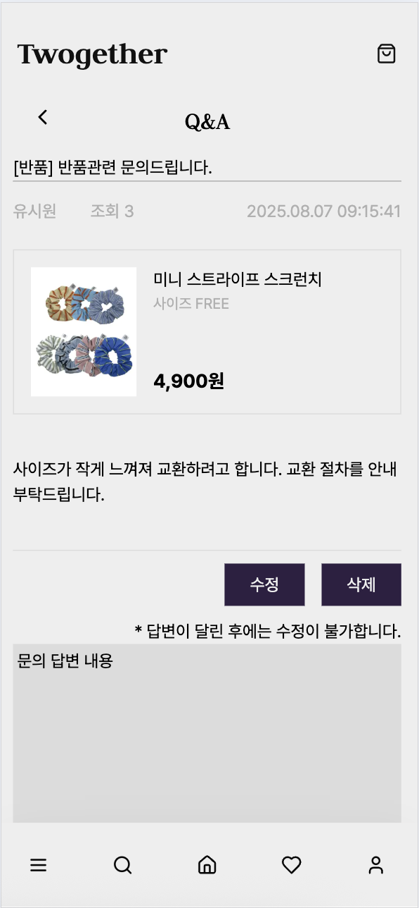
    </td>
  </tr>
  <tr>
    <td>
      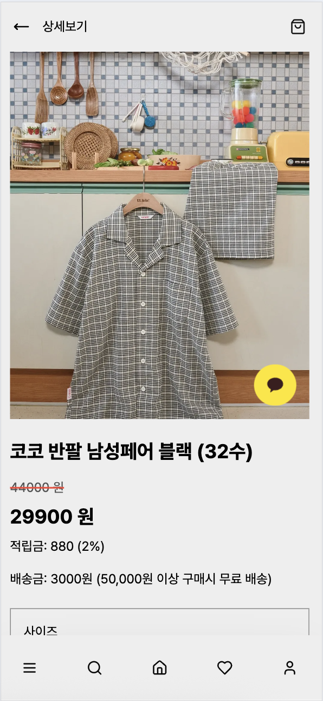
    </td>
    <td>
      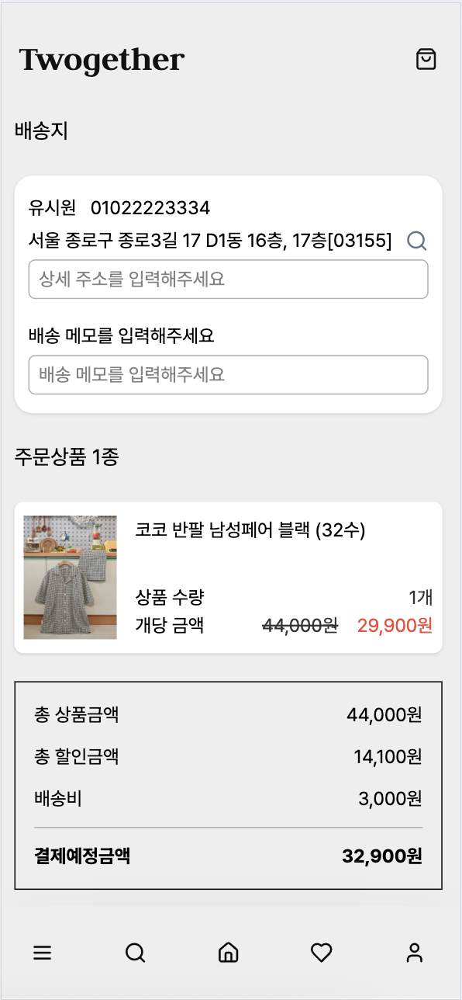
    </td>
    <td>
      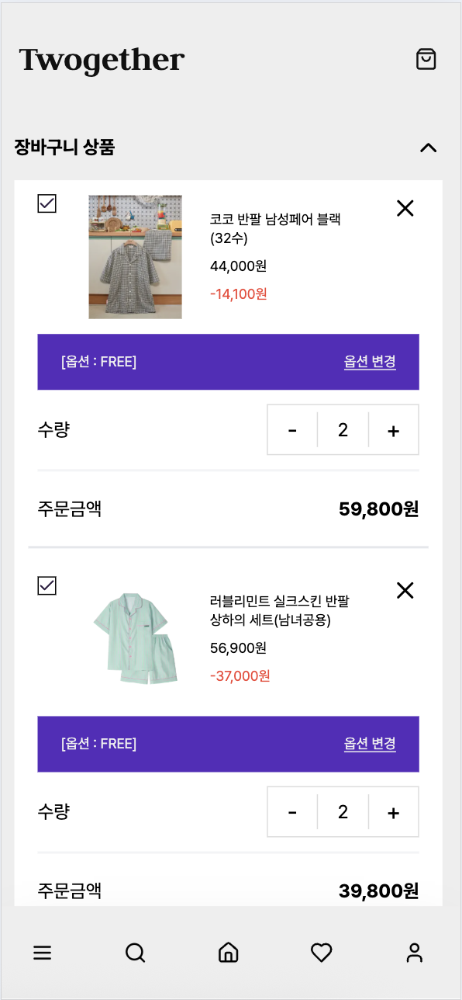
    </td>
  </tr>
  <tr>
    <td>
      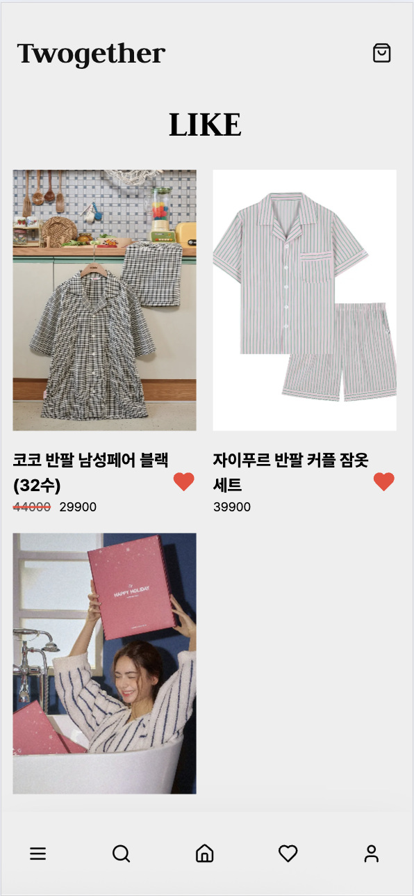
    </td>
    <td>
      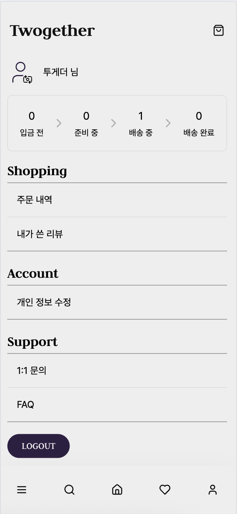
    </td>
    <td>
    </td>
  </tr>
</table>


## 데일리 스크럼

**2025년 7월**
<br />

| 일 | 월 | 화 | 수 | 목 | 금 | 토 |
|:--:|:--:|:--:|:--:|:--:|:--:|:--:|
|  |   | 1 | 2 | 3 | 4 | 5 |
| 6 | 7 | [8](https://github.com/FRONTENDBOOTCAMP-13th/Final-02-Twogether/wiki/scrum-0708) | [9](https://github.com/FRONTENDBOOTCAMP-13th/Final-02-Twogether/wiki/scrum-0709) | [10](https://github.com/FRONTENDBOOTCAMP-13th/Final-02-Twogether/wiki/scrum-0710) | [11](https://github.com/FRONTENDBOOTCAMP-13th/Final-02-Twogether/wiki/scrum-0711) | 12 |
| 13 | [14](https://github.com/FRONTENDBOOTCAMP-13th/Final-02-Twogether/wiki/scrum-0714) | [15](https://github.com/FRONTENDBOOTCAMP-13th/Final-02-Twogether/wiki/scrum-0715) | [16](https://github.com/FRONTENDBOOTCAMP-13th/Final-02-Twogether/wiki/scrum-0716) | [17](https://github.com/FRONTENDBOOTCAMP-13th/Final-02-Twogether/wiki/scrum-0717) | 18 | 19 |
| 20 | [21](https://github.com/FRONTENDBOOTCAMP-13th/Final-02-Twogether/wiki/scrum-0721) | [22](https://github.com/FRONTENDBOOTCAMP-13th/Final-02-Twogether/wiki/scrum-0722) | [23](https://github.com/FRONTENDBOOTCAMP-13th/Final-02-Twogether/wiki/scrum-0723) | [24](https://github.com/FRONTENDBOOTCAMP-13th/Final-02-Twogether/wiki/scrum-0724) | [25](https://github.com/FRONTENDBOOTCAMP-13th/Final-02-Twogether/wiki/scrum-0725) | 26 | 
| [27](https://github.com/FRONTENDBOOTCAMP-13th/Final-02-Twogether/wiki/scrum-0727) | [28](https://github.com/FRONTENDBOOTCAMP-13th/Final-02-Twogether/wiki/scrum-0728) | [29](https://github.com/FRONTENDBOOTCAMP-13th/Final-02-Twogether/wiki/scrum-0729) | [30](https://github.com/FRONTENDBOOTCAMP-13th/Final-02-Twogether/wiki/scrum-0730) | [31](https://github.com/FRONTENDBOOTCAMP-13th/Final-02-Twogether/wiki/scrum-0729)  |  |

**2025년 8월**
<br />
| 일  | 월  | 화  | 수  | 목  | 금  | 토  |
|:--:|:--:|:--:|:--:|:--:|:--:|:--:|
|    |    |    |    |    | 1  | 2  |
| 3 | [4](https://github.com/FRONTENDBOOTCAMP-13th/Final-02-Twogether/wiki/scrum-0804) | [5](https://github.com/FRONTENDBOOTCAMP-13th/Final-02-Twogether/wiki/scrum-0805) | [6](https://github.com/FRONTENDBOOTCAMP-13th/Final-02-Twogether/wiki/scrum-0806) | [7](https://github.com/FRONTENDBOOTCAMP-13th/Final-02-Twogether/wiki/scrum-0807) | 8 | 9 |
| 10 | 11 | 12 | 13 | 14 | 15 | 16 |
| 17 | 18 | 19 | 20 | 21 | 22 | 23 |
| 24 | 25 | 26 | 27 | 28 | 29 | 30 |
| 31 |    |    |    |    |    |    |

## 관련 문서

- 📁 [프로젝트 위키](https://github.com/FRONTENDBOOTCAMP-13th/Final-02-Twogether/wiki)
  - 개발 관련 문서: 코딩 컨벤션, 깃 컨벤션, PR 가이드, 폴더 구조
  - 주요 기능 문서: 상품 관련 기능, 구매 및 결제 기능, 회원 관리 기능, 커뮤니티 기능
- 🎨 [Figma 디자인](https://www.figma.com/design/CB2f3xMmV9Ps0gviv1XsNb/Twogether?node-id=0-1&t=XsWS5qWNqGMxW2Rq-1)
- 🗒️ [API 명세서](https://fesp-api.koyeb.app/market/apidocs/#/)


## 라이선스

본 프로젝트는 학습 목적으로 제작되었으며, 상업적 용도로 사용되지 않습니다.
